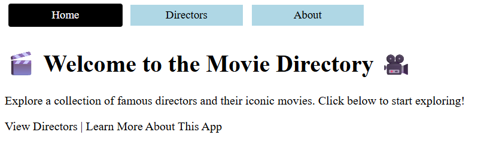
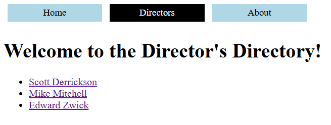
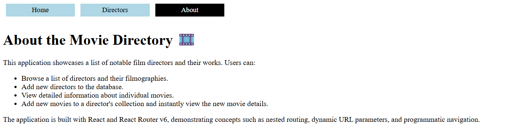

# Movie Directory Routing Lab

## Overview

This project is a React Router v6 lab that builds a Movie Directory application. Users can browse directors, view their movies, create new directors, add movies to existing directors, and navigate between nested routes using React Router.

The lab focuses on:

- React Router v6
- Nested Routes
- Outlet Context
- URL Parameters
- Programmatic Navigation
- Navigation Links

---

## Features

### Director Management

- View a list of directors
- View details for an individual director
- Create new directors
- Navigate directly to a director's page

### Movie Management

- View movies associated with a director
- View details for an individual movie
- Add new movies to a director
- Automatically navigate to the newly created movie page

### Routing

The application uses nested routing to organize directors and movies.

```txt
/
├── about
└── directors
    ├── new
    ├── :id
    │   ├── movies/new
    │   └── movies/:movieId
```

---

## Technologies Used

- React
- React Router DOM v6
- Vite
- JSON Server
- UUID

---

## Screenshots

### Home Page



### Directors Page



### About Page



## Installation

Install dependencies:

```bash
npm install
```

Install React Router:

```bash
npm install react-router-dom@6
```

---

## Running the Application

Start the JSON server:

```bash
npm run server
```

Start the Vite development server:

```bash
npm run dev
```

Open the application in your browser:

```txt
http://localhost:5173
```

---

## Routing Structure

| Route | Component |
|---------|---------|
| `/` | Home |
| `/about` | About |
| `/directors` | DirectorContainer |
| `/directors/new` | DirectorForm |
| `/directors/:id` | DirectorCard |
| `/directors/:id/movies/new` | MovieForm |
| `/directors/:id/movies/:movieId` | MovieCard |

---

## React Router Concepts Implemented

### BrowserRouter

Provides routing context for the entire application.

### Routes and Route

Defines all application routes and nested route relationships.

### Outlet

Used to render nested child routes inside parent components.

Examples:

- DirectorContainer renders DirectorList, DirectorForm, and DirectorCard
- DirectorCard renders MovieForm and MovieCard

### useOutletContext

Used to share data between parent and child routes.

Examples:

- DirectorContainer shares directors and setDirectors
- DirectorCard shares the selected director

### useParams

Used to access dynamic route parameters.

Examples:

```js
const { id } = useParams();
const { movieId } = useParams();
```

### Link and NavLink

Used for client-side navigation without page reloads.

### useNavigate

Used to redirect users after successful form submissions.

Example:

```js
navigate(`/directors/${id}/movies/${newMovie.id}`);
```

---

## Data Flow

### DirectorContainer

Responsible for:

- Fetching directors
- Storing directors in state
- Providing data through Outlet Context

### DirectorCard

Responsible for:

- Finding the selected director using route parameters
- Providing director data to nested movie routes

### MovieCard

Responsible for:

- Finding the selected movie using route parameters
- Displaying movie details

### MovieForm

Responsible for:

- Creating new movies
- Updating director data
- Redirecting to the newly created movie page

---

## Testing

The application passes all provided Vitest tests, including:

- Home page rendering
- About page navigation
- Director list rendering
- Director detail pages
- Movie detail pages
- Director creation routes
- Movie creation routes
- Invalid director handling
- Invalid movie handling

---

## Learning Objectives

This lab demonstrates how to:

- Configure React Router v6
- Create nested route structures
- Pass data through Outlet Context
- Access URL parameters with useParams
- Navigate programmatically with useNavigate
- Build dynamic detail pages
- Manage state across nested routes

---

## Author

Created by Matthew Swanberg as part of a React Router v6 routing and navigation lab (course 5 mod 6).